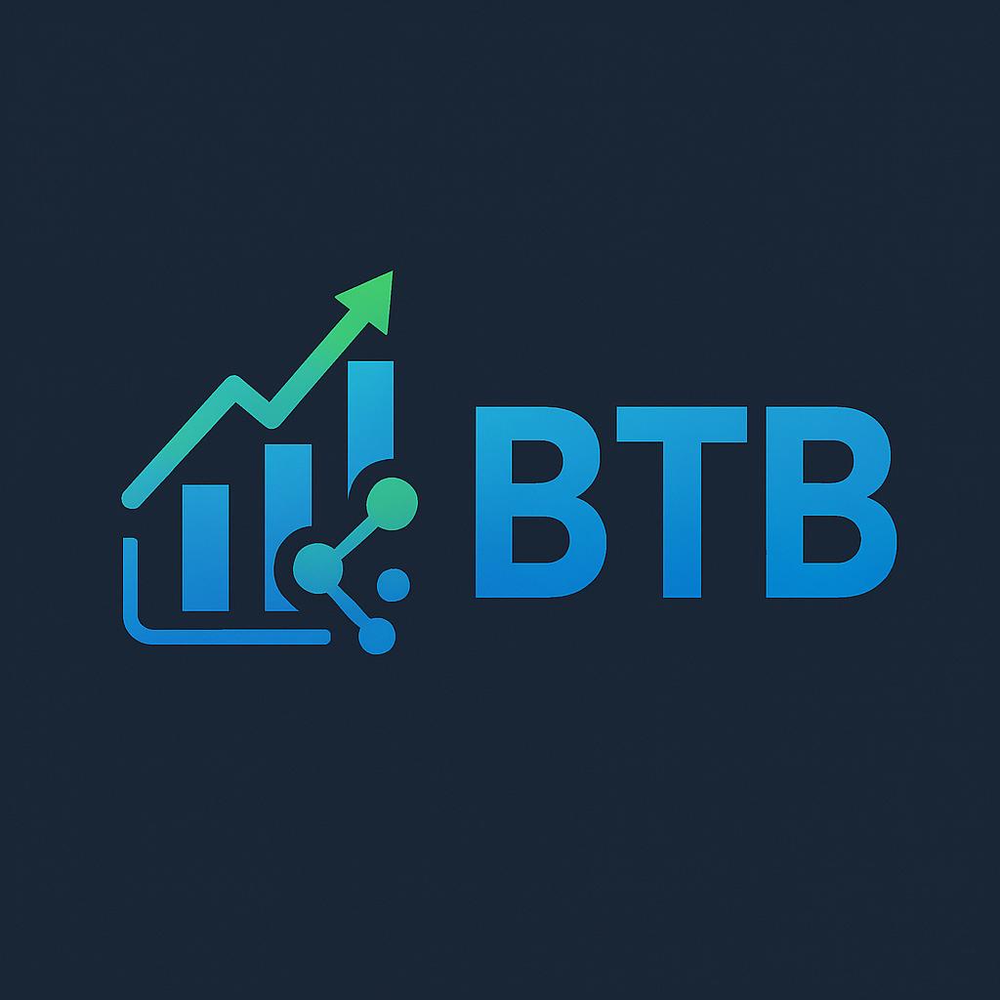

# Best Trading Bot (BTB)

<div align="center">



**A powerful, customizable cryptocurrency trading bot with machine learning capabilities**

[](https://opensource.org/licenses/MIT)
[](https://www.python.org/downloads/)
[](https://gianlucamazza.github.io/btb-besttradingbot)
[](https://gianlucamazza.github.io/btb-besttradingbot/)

</div>

## 📖 Overview

Best Trading Bot (BTB) is a sophisticated cryptocurrency trading platform designed for both beginners and experienced traders. It combines traditional trading strategies with advanced machine learning models to automate and optimize your trading decisions.

### Key Features

- **📊 Multiple Trading Strategies**: Choose from various built-in strategies or create your own custom approach
- **🔍 Advanced Backtesting Engine**: Test strategies against historical data with comprehensive performance metrics
- **⚡ Real-time Trading**: Execute trades automatically on supported cryptocurrency exchanges
- **🤖 Machine Learning Models**: Leverage predictive models to enhance trading decisions
- **📈 Data Analysis Tools**: Visualize market trends and performance metrics
- **⚙️ Highly Customizable**: Tailor settings to your specific trading preferences

## 🚀 Quick Start

### Installation

```bash
# Clone the repository
git clone https://github.com/gianlucamazza/btb-besttradingbot.git
cd btb-besttradingbot

# Create and activate a virtual environment
python -m venv .venv
source .venv/bin/activate  # On Windows: .venv\Scripts\activate

# Install dependencies
pip install -e .
```

### Basic Usage

```python
from btb.bot import TradingBot
from btb.config import load_config

# Load configuration
config = load_config('config/default.json')

# Initialize and run the trading bot
bot = TradingBot(config)
bot.run()
```

For more detailed instructions, see the [Quick Start Guide](https://gianlucamazza.github.io/btb-besttradingbot/quick_start.html).

## 📚 Documentation

Complete documentation is available at our [documentation site](https://gianlucamazza.github.io/btb-besttradingbot/).

Key sections:
- [Installation Guide](https://gianlucamazza.github.io/btb-besttradingbot/installation.html)
- [Configuration Options](https://gianlucamazza.github.io/btb-besttradingbot/configuration.html)
- [Trading Strategies](https://gianlucamazza.github.io/btb-besttradingbot/strategies.html)
- [Backtesting Framework](https://gianlucamazza.github.io/btb-besttradingbot/backtesting.html)
- [Machine Learning Models](https://gianlucamazza.github.io/btb-besttradingbot/models.html)
- [API Reference](https://gianlucamazza.github.io/btb-besttradingbot/api_reference.html)

## 🏗️ Project Structure

```
btb-besttradingbot/
├── btb/                 # Core source code
│   ├── strategies/      # Trading strategies
│   ├── models/          # ML models
│   ├── data/            # Data handling
│   └── utils/           # Utility functions
├── config/              # Configuration files
├── docs/                # Documentation
├── notebooks/           # Jupyter notebooks
├── tests/               # Unit tests
└── results/             # Backtesting results
```

## 🤝 Contributing

Contributions are welcome! Please see our [Contributing Guidelines](https://gianlucamazza.github.io/btb-besttradingbot/contributing.html) for details on how to get started.

### Development Setup

```bash
# Install development dependencies
pip install -e ".[dev]"

# Set up pre-commit hooks
pre-commit install
```

## 📜 License

This project is licensed under the MIT License - see the [LICENSE](LICENSE) file for details.

## ⭐ Show Your Support

If you find BTB useful, please consider giving it a star on GitHub and sharing it with others!
